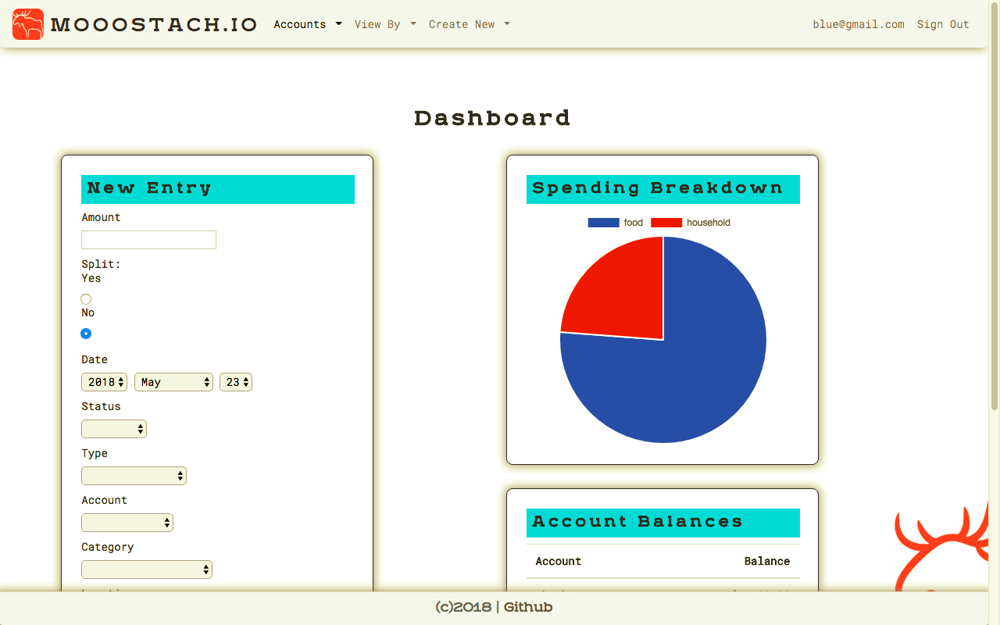
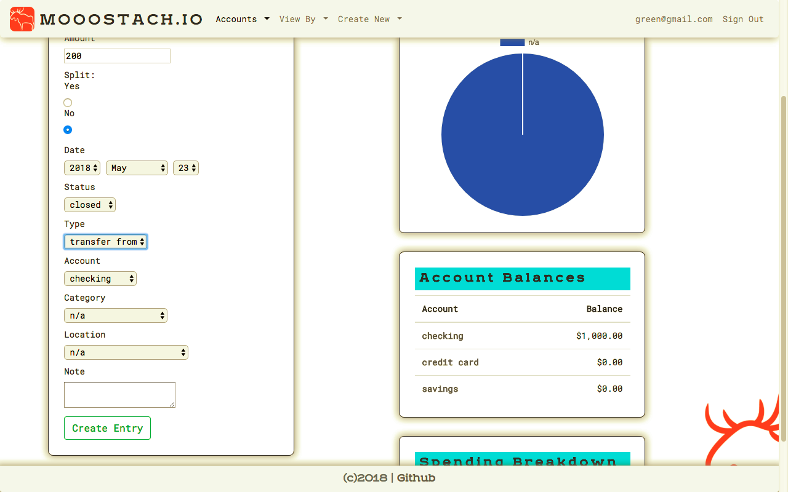
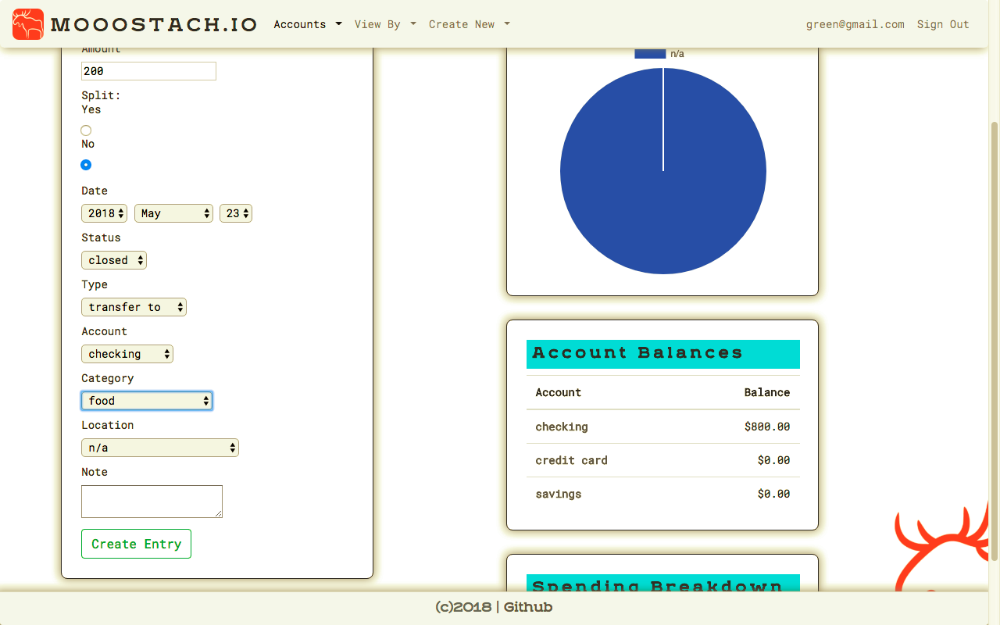
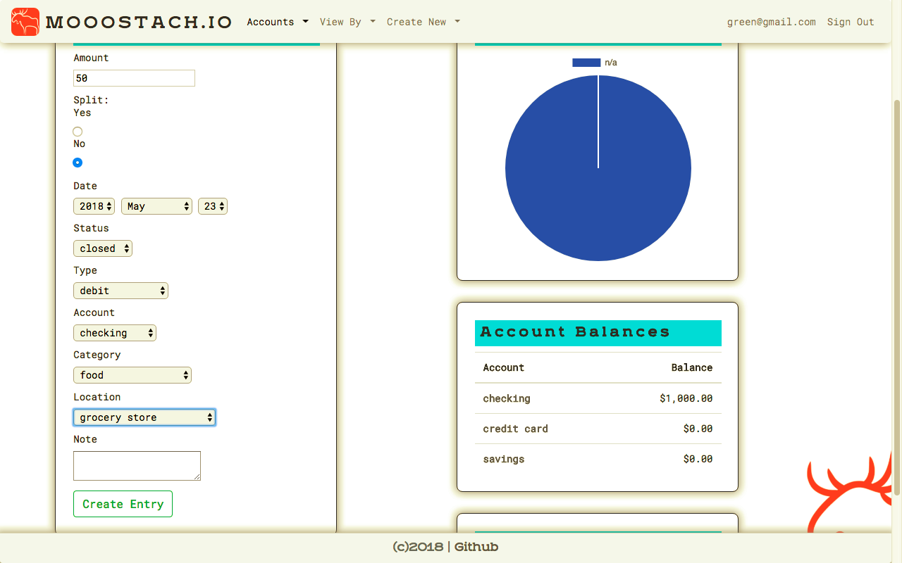
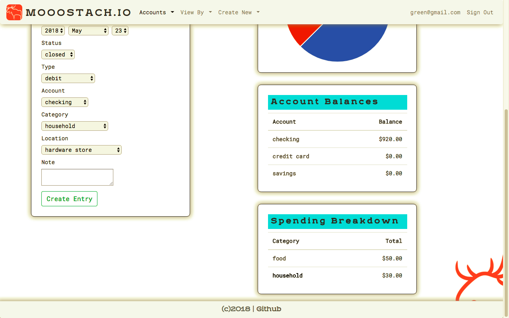

# README

## Mooostach.io
### A money managing application to help you visualize where your money is going.

## Getting Started

* Clone the repository to your Desktop:
`git clone https://github.com/josephcardillo/mooostachio.git`

* cd into the repository and run your rails server:
`rails s`

* Run `localhost:3000`

### Log In or Sign Up

### Start Creating Transactions

In order to get the most out of Mooostachio, start by adding your beginning balance to your checking and/or savings account as a 'deposit'.

Let's say the balance in your checking account is $1,000. Add this amount, then click 'Create Entry':

Your checking account balance is now $1,000. Now you can transfer money from one category to the next. For example, if you spend $200 per week on food, you can transfer this amount to your food category at the beginning of the week:

Transfer that same amount using the 'transfer to' type:

